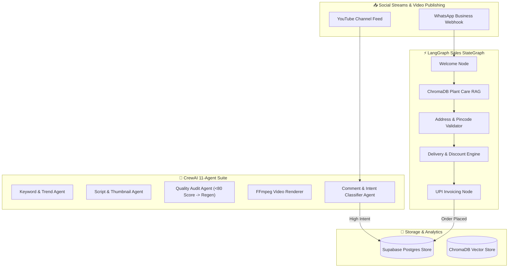

<div align="center">

# 🌿 VyaparAI

### **Autonomous Multi-Agent Marketing, Regional Localization & Conversational Sales Platform**

*Empowering Micro-Businesses with AI Marketing Crews, Stateful WhatsApp Sales Engines, and Video Generation.*

---

[](https://nextjs.org/)
[](https://fastapi.tiangolo.com/)
[](https://www.python.org/)
[](https://crewai.com)
[](https://langchain-ai.github.io/langgraph/)
[](https://supabase.com)
[](https://tailwindcss.com)
[](LICENSE)

</div>

---

## 📌 Executive Summary

**VyaparAI** is an end-to-end, production-grade AI platform built to automate digital marketing, regional language content localization, social comment monitoring, buyer intent classification, and conversational sales for micro-businesses and local nurseries.

By unifying an **11-Agent CrewAI Orchestrator**, a **Stateful LangGraph Sales Graph**, **FFmpeg GPU Video Compiler**, and **Supabase Realtime & ChromaDB Vector Stores**, VyaparAI turns social inquiries into completed UPI payments on WhatsApp automatically.

---

## 🌟 Key Features

### 🎬 1. Automated Video Marketing Generation
- **Multi-Agent Scripting**: Keyword extraction, Google Trends analysis, script writing, and thumbnail prompter.
- **Regional Localization**: Synchronized Text-to-Speech (TTS) voiceovers and styled ASS subtitle rendering in **Malayalam, Hindi, Tamil, Telugu, and English**.
- **Quality Audit & Versioning**: Automatic script scoring (out of 100). Triggers regeneration loops (V1 $\rightarrow$ V2 $\rightarrow$ V3) if script score is $< 80$.
- **Direct YouTube Publishing**: Auto-uploads approved MP4 Shorts and custom thumbnails to connected YouTube channels.

### 💬 2. YouTube Comment Monitoring & Intent Classifier
- **5-Second Polling Loop**: Continuously scans video comment threads for buyer inquiries.
- **LLM Intent Classification**: Categorizes comments into `HIGH_INTENT` (buying queries, price, shipping), `MEDIUM_INTENT`, `LOW_INTENT`, or `SPAM`.
- **Human-in-the-Loop Review**: Drafts AI replies and queues them in the **Reply Approval Inbox** when Auto-Reply is set to manual.
- **Automatic Lead Promotion**: Immediately registers high-intent authors into the CRM Lead pipeline.

### 🤖 3. LangGraph Stateful WhatsApp Sales Engine
- **Stateful Conversation Graph**: Manages customer state transitions (`WELCOME` $\rightarrow$ `QA_LOOP` $\rightarrow$ `ADDRESS_COLLECTION` $\rightarrow$ `PAYMENT`).
- **Strict Address Validation**: Enforces full customer address requirements (**Full Name**, **Street**, **District**, **State**, and **6-digit Indian Pincode**).
- **Nursery Care RAG**: Queries ChromaDB vector store to answer plant watering, sunlight, and toxic pet safety queries.
- **Multi-Product Catalog Integration**: Serves product photos, descriptions, and pricing across your entire inventory.

### 🚚 4. Nursery Delivery Logistics & Discount Engine
- **Free Shipping Zone**: Configurable free delivery radius (e.g. `5 km` – `10 km`).
- **Distance Rates**: Automatic distance calculations charging ₹10/km for short distance ($< 5\text{ km}$) and ₹15/km for long distance ($> 10\text{ km}$).
- **Bulk & Loyalty Discounts**: Automatic 10% discount for orders $\ge$ ₹1,500 and 15% lifetime discount for repeat customers ($\ge$ 5 past orders).

### 📈 5. Real-Time CRM & Live Notifications Drawer
- **Lead Dashboard**: Unified pipeline combining WhatsApp chat leads and YouTube comment leads with real daily acquisition trends.
- **Notifications Center**: Real-time polling drawer alerting merchants to pending comment approvals, new qualified leads, and paid orders.

---

## 🏗️ Architecture Blueprint



---

## 🤖 CrewAI 11-Agent Roster

| Agent Name | Engine / Model | Core Responsibility |
| :--- | :--- | :--- |
| **Keyword Agent** | Ollama / Llama 3.1 | Classifies catalog products into primary, long-tail, and regional search terms. |
| **Trend Agent** | SerpAPI & Google Trends | Fetches viral search topics and writes SEO titles. |
| **Script Agent** | CrewAI Sequential | Writes 15-30s ad scripts with Hooks, Problems, Solutions, and CTAs. |
| **Thumbnail Agent** | Prompter Engine | Generates Midjourney/DALL-E layout prompts and text overlays. |
| **Quality Agent** | Audit Evaluator | Conducts quality checks (0-100). Forces regeneration if score is $< 80$. |
| **Video Agent** | FFmpeg Worker | Renders 1080x1920 MP4 video Shorts with Unicode subtitles and TTS audio. |
| **Approval Agent** | Admin Gatekeeper | Manages human approval / version regeneration workflows (V1 $\rightarrow$ V2). |
| **YouTube Publishing Agent** | Google OAuth API | Uploads approved MP4 video deliverables to connected channels. |
| **Comment Collector Agent** | YouTube Data API | Scans comment threads every 5 seconds, filtering spam and duplicate posts. |
| **Intent Classifier Agent** | Hybrid Regex + LLM | Classifies customer comment intent (`HIGH_INTENT`, `MEDIUM_INTENT`, `LOW_INTENT`, `SPAM`). |
| **Lead Agent** | Supabase Ingester | Ingests high-intent social leads into the sales CRM database. |

---

## 📁 Repository Structure

```text
VyaparAI/
├── backend/
│   ├── agents/                   # Agent Definitions (Keyword, Trend, Script, Quality, etc.)
│   ├── crews/                    # CrewAI Orchestrators (marketing_crew, youtube_monitor_crew)
│   ├── database/                 # Supabase & Mock JSON Migration Schemas
│   ├── langgraph/                # LangGraph Stateful Sales Graph (sales_workflow.py)
│   ├── modules/
│   │   ├── ai_module/            # LLM & RAG Services
│   │   ├── conversation_module/  # Chat Thread State Managers
│   │   ├── messaging_module/     # Webhook Router & Handlers
│   │   ├── payment_module/       # UPI Payment Link Generators
│   │   ├── video_monitoring_module/ # Comment Poller & Lead Ingester
│   │   └── whatsapp_module/      # Evolution API WhatsApp Gateway
│   ├── routers/                  # FastAPI REST Endpoints
│   ├── services/                 # FFmpeg Video Compiler, gTTS Regional Voice, ChromaDB
│   └── main.py                   # FastAPI Application Entrypoint
├── frontend/
│   ├── app/                      # Next.js 14 App Router Pages
│   │   ├── about/                # Company Mission & Vision
│   │   ├── agent-details/        # 11-Agent Command Center
│   │   ├── analytics/            # Master Analytics & Performance Dashboard
│   │   ├── approval/             # Video Approval & Version Control
│   │   ├── crm/                  # Customer CRM Roster
│   │   ├── faq/                  # Help & Knowledgebase
│   │   ├── jobs/                 # Background FFmpeg Video Render Queue
│   │   ├── lead-dashboard/       # Lead Management CRM Dashboard
│   │   ├── live-chat/            # WhatsApp Live Customer Chat & Target Catalog
│   │   ├── module-details/       # Infrastructure & Data Flow Reference
│   │   ├── reply-approval/       # Pending Comment Auto-Reply Inbox
│   │   ├── upload/               # Campaign Creation Studio
│   │   └── whatsapp-settings/    # WhatsApp Instance & Nursery Delivery Logistics
│   ├── components/               # Glassmorphic Layouts, Sidebar & Notifications Drawer
│   └── package.json
├── nursery_delivery_config.json  # Saved Shipping & Discount Configuration
├── start_all.bat                 # Unified Launch Script (Windows)
└── README.md
```

---

## ⚡ Quick Start & Local Development

### 1. Prerequisites
- **Node.js**: `v18.x` or `v20.x`
- **Python**: `v3.10` or `v3.11`
- **FFmpeg**: Installed and available on system `PATH`

### 2. Backend Environment Setup
Create a `.env` file in the `backend/` directory:

```env
PORT=8000
SUPABASE_URL=https://your-supabase-url.supabase.co
SUPABASE_KEY=your-supabase-anon-key
OLLAMA_BASE_URL=http://localhost:11434
OPENAI_API_KEY=your-openai-key-optional
EVOLUTION_API_ENDPOINT=http://localhost:8080
EVOLUTION_API_KEY=your-evolution-key
```

### 3. Running the Backend Server
```bash
cd backend
python -m venv venv
# On Windows:
.\venv\Scripts\activate
# On Linux/macOS:
source venv/bin/activate

pip install -r requirements.txt
python main.py
```
*Backend API will be live at `http://localhost:8000` (API Docs at `http://localhost:8000/docs`).*

### 4. Running the Frontend Dashboard
```bash
cd frontend
npm install
npm run dev
```
*Frontend Dashboard will be live at `http://localhost:3000`.*

### 5. Launching via Script (Windows)
Double click `start_all.bat` or run:
```cmd
start_all.bat
```

---

## 🔌 API Reference Overview

| Endpoint | Method | Description |
| :--- | :--- | :--- |
| `GET /api/health` | `GET` | Health check endpoint returning backend service statuses. |
| `POST /marketing/generate` | `POST` | Triggers CrewAI marketing pipeline for product campaign creation. |
| `GET /youtube/leads/dashboard` | `GET` | Returns aggregated Lead Management CRM metrics & daily trends. |
| `GET /youtube-monitoring/comments/pending` | `GET` | Fetches pending comment auto-reply drafts awaiting merchant review. |
| `POST /conversations` | `POST` | Initiates or advances a LangGraph WhatsApp sales dialogue session. |
| `GET /analytics/campaigns` | `GET` | Returns revenue, adoption rate, auto-reply counts, and top campaigns. |

---

## 📜 License

Distributed under the **MIT License**. See `LICENSE` for more information.

<div align="center">
  <sub>Built with ❤️ by the VyaparAI Team.</sub>
</div>
